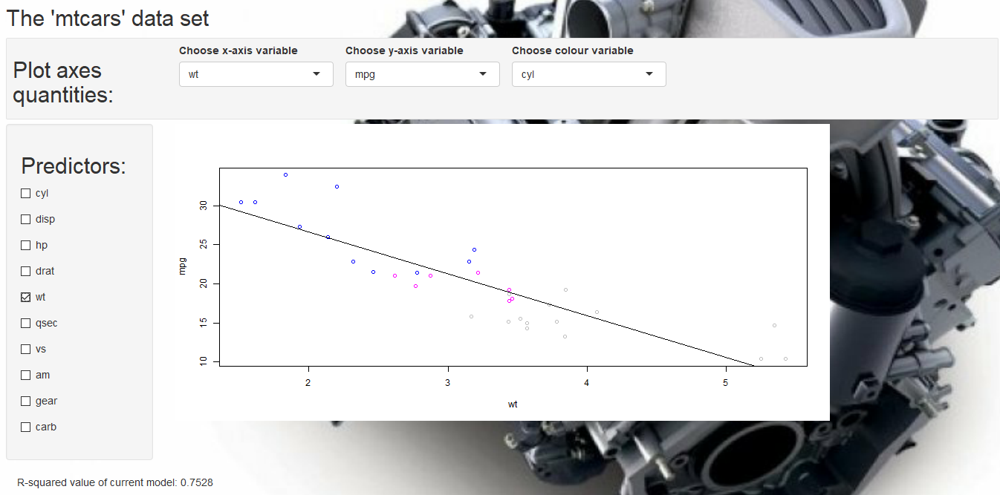

Application Pitch
========================================================
author: Martin Richardson
date: October 28th 2017
autosize: false
font-import: http://fonts.googleapis.com/css?family=Risque
font-family: 'Risque'

<style>
.small-code pre code {
  font-size: 1.0em;
}

.tiny-code pre code {
  font-size: 0.75em;
}

.reveal section del {
  color: yellow;
}

body {
      background-image:     
      url(https://s1.cdn.autoevolution.com/images/news/gallery/ferrari-snatches-international-engine-of-the-year-award-in-four-categories_9.jpg);
      background-position: center center;
      background-attachment: fixed;
      background-repeat: no-repeat;
      background-size: 100% 100%;
}
.section .reveal .state-background {
    background-image: url(https://s1.cdn.autoevolution.com/images/news/gallery/ferrari-snatches-international-engine-of-the-year-award-in-four-categories_9.jpg);
    background-position: center center;
    background-attachment: fixed;
    background-repeat: no-repeat;
    background-size: 100% 100%;
}


</style>





Slide 2 - The Data
========================================================
class: small-code

- ~~The 'mtcars' data set is used for this application:~~


```r
head(mtcars)
```

```
                   mpg cyl disp  hp drat    wt  qsec vs am gear carb
Mazda RX4         21.0   6  160 110 3.90 2.620 16.46  0  1    4    4
Mazda RX4 Wag     21.0   6  160 110 3.90 2.875 17.02  0  1    4    4
Datsun 710        22.8   4  108  93 3.85 2.320 18.61  1  1    4    1
Hornet 4 Drive    21.4   6  258 110 3.08 3.215 19.44  1  0    3    1
Hornet Sportabout 18.7   8  360 175 3.15 3.440 17.02  0  0    3    2
Valiant           18.1   6  225 105 2.76 3.460 20.22  1  0    3    1
```

- ~~32 observations, each of a different model of car~~
- ~~11 quantities measured in each observation~~
- ~~User may be interested in how these quantities relate to each other~~
- ~~For example, what are the most important predictors of the miles-per-gallon ('mpg') rating of each car?~~


Slide 3 - App Operations
========================================================

- ~~App takes user input to build linear model via lm() function~~
- ~~Outcome quantity is always 'mpg'~~
- ~~List of checkboxes allow user to select other variables to be predictors:~~

~~lm(formula = "mpg ~ predictor_1 + predictor_2 + ...", data = mtcars)~~
- ~~App allows user to choose any 2 of the 11 quantities to be the x-axis and y-axis on a 2-D scatter plot~~
- ~~Regression line based on linear model appears on plot~~
- ~~User can also select a third quantity by which the points will be coloured~~
 


========================================================
class: tiny-code
autosize: true

~~Say the user selects 'wt' and 'vs' to be the predictors of 'mpg' and also 'wt' and 'mpg' to be the x and y-axes of the scatter plot:~~

```r
current_formula <- "mpg ~ wt + vs" 
mod <- lm(formula = as.formula(current_formula), data = mtcars)
plot(x = mtcars$wt, y = mtcars$mpg, col = mtcars$cyl, type = "p", xlab = "wt", ylab = "mpg")
abline(mod)
```


Slide 5 - Further Info
========================================================

- ~~App also displays information about linear model~~
- ~~R-squared value indicates variance accounted for by current model~~
- ~~Each time user makes a change, linear model is recalculated and new R-squared value appears~~
- ~~Using current example:~~


```r
summary(mod)$r.squared
```

```
[1] 0.8009907
```

- ~~Source code and app documentation available at github: martinrichardson123456/
developing_data_products__week_4_assignment~~

